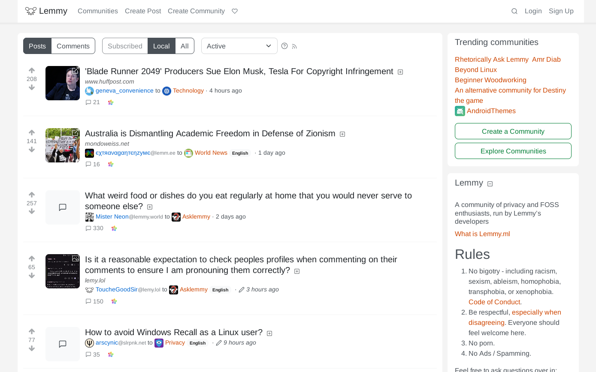

# Lemmy Modern UI Theme
This Firefox extension replaces the CSS styles on Lemmy instances to create a modern looking theme. Works with Lemmy 0.18.x and 0.17.x.

Get the addon: https://addons.mozilla.org/firefox/addon/lemmy-modern-ui-theme



## Using The Theme On Your Lemmy Instance
To use the theme on your instance, [download the CSS files from the Releases page](https://github.com/pkrasicki/lemmy-modern-ui-theme-addon/releases). Then put the chosen files into the `extra_themes` folder or [follow the documentation](https://join-lemmy.org/docs/administration/theming.html).

## Building
### Prerequisites
- [Node.js 18.x](https://nodejs.org)

### Building The Addon
Install dependencies:

```
npm install
```

Build the addon:
```
npm run build
```

### Building The Theme Only
You can build the CSS styles to use them on your Lemmy instance (you can also [get them from Releases page](https://github.com/pkrasicki/lemmy-modern-ui-theme-addon/releases)):
```
npm run build-theme
```

The following files will appear in the `dist` folder:

`modern-light.css` - light theme only

`modern-dark.css` - dark theme only

`modern-auto.css` - contains both themes and switches between them automatically depending on user's current system settings (the default Lemmy theme works the same way)

## Screenshots


