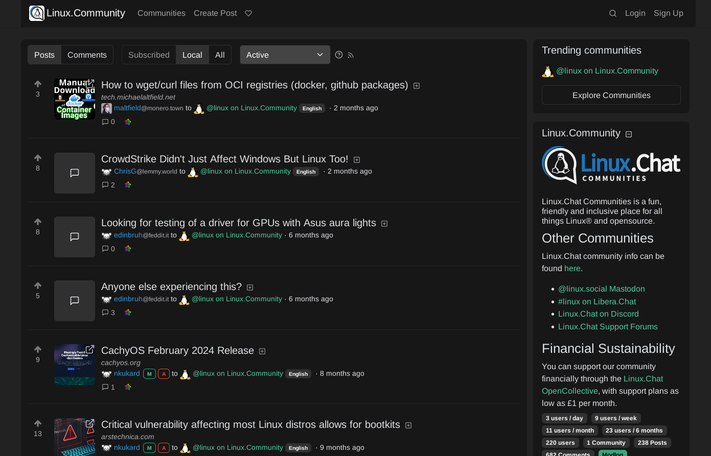

# Lemmy Modern UI Theme
This Firefox extension replaces the CSS styles on Lemmy instances to create a modern looking theme.

https://addons.mozilla.org/firefox/addon/lemmy-modern-ui-theme

# Screenshots

